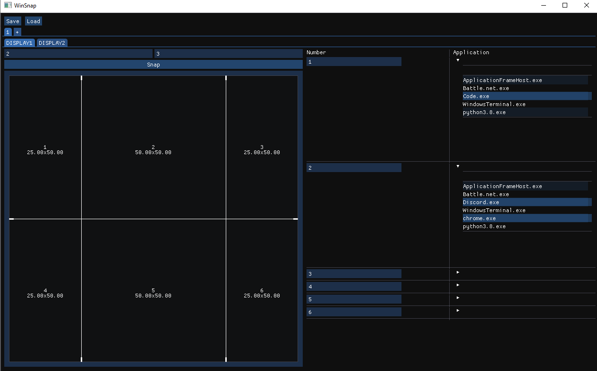

# winsnap
Snap windows into a customizable grid

## How to Use

1. Choose which display you want to control
2. Set the number of rows and column in the display. By default each grid will be of equal size.
3. Adjust the rows and columns as you see fit
4. Then in the table on the right, choose which applications will go in each area. You can select
   multiple applications to be in one area and leave other areas blank.
5. Repeat for the other display(s).
6. Once happy, push the ``Snap`` button to move the windows into place.
7. You can create more than one profile. These different profiles can be useful for setting up
   different types of work (gaming, writing, coding, etc.) or virtual desktops.
8. You can then save the current setup. This setup will be the new default on startup. Note that
   there are different setups based on different monitors (there's a different configuration for
   your laptop alone versus your laptop connected to a monitor versus your laptop connected to a
   different monitor).

## Motivation

I wanted to create this app for a couple reasons. First, I got an ultra wide monitor and wanted to
make much better use of it than snapping to windows to half the screen. I like to have my text
editor in the center, a chrome window on one side, and chat window on the other. The other reason
is I wanted to play around with [DearPyGui](https://github.com/hoffstadt/DearPyGui) as I only have
experience making PyQT GUIs.  

### Similar Apps

There are other Applications (some listed below) that already do this but I still wanted to make my
own, mainly because I wanted to use this for work and didn't feel like wasting the information
security teams time checking out a new app.

* http://windowgrid.net/ : This was my favorite of the apps that I tried but wish the website was
  secured - don't feel too good about downloading from an insecure website and then running an
  executable from the website.
* [Samsung Easy Setting Box](
   https://displaysolutions.samsung.com/solutions/monitor-solution/easy-setting-box) : It was really
   hard to get the software in the first place and then once I did it was a pretty terrible
   experience. Also, has compatibility restrictions which really limits the use.

## Development

I only really plan on working on this project as DearPyGui makes new releases to keep up with the
project and if I realize there are **easy** fixes for me to make that will make it better.
Otherwise, besides maybe a few issues I won't be working on this project much more. Feel free to
open an issue but my response I will probably ask you to create a PR and/or fork the project to make
the fix yourself unless I think there is a good learning opportunity for me. This app does enough
for me to use it and anything fancier will probably take too much time.

### Development Setup

1. Clone the project.
2. Make a python3.8 virtual environment
3. ``pip install -r requirements.txt``
4. ``pip install -r dev-requirements.txt``
5. After making changes, run ``inv format``

### What about testing?

Until DearImGui makes a [testing framework](https://github.com/ocornut/imgui/issues/435) that
DearPyGui wraps, I don't plan on any testing.

## Install

Follow the development setup then run ``inv install`` and go through the installer that appears.
